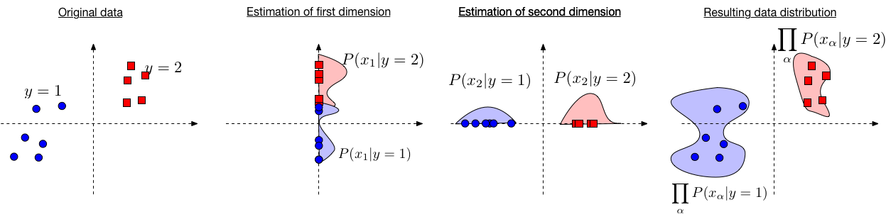

## Naive Bayes Classifier

Naive Bayes is straightforward and fast classification algorithm. It is Generative algorithms that successfully used in various applications such as spam filtering, text classification and sentiment analysis, and recommender systems.

Naive Bayes classifier assumes that the effect of a particular feature in a class is independent of other features. This assumtion is not valid most of the times. However, the resulting classifiers can work well in practice even if this assumption is violated. For example, in spam filtering. The data is emails and the label is spam/not-spam. based on Naive Bayes theorem the words (features) in an email are conditionally independent. Clearly, this is not true. Neither the words of spam or not-spam emails are drawn independently at random.

 

$$
P(\mathbf{x} | y) = \prod_{\alpha = 1}^{d} P(x_\alpha | y), \text{where } x_\alpha = [\mathbf{x}]_\alpha \text{ is the value for feature } \alpha
$$

 
 

 

Fig. 1: Illustration behind the Naive Bayes algorithm. We estimate independently in each dimension and then obtain an estimate of the full data distribution by assuming conditional independence.
<!-- http://www.cs.cornell.edu/courses/cs4780/2018fa/lectures/lecturenote05.html -->

There are three main regime that naive Bayes classifier can be used:
* Categorical features: Each feature $\alpha$ falls into one categories.
* Multinomial features: If feature values don't represent categories but counts we need to use a Multinomial features.
* Continuous features (Gaussian Naive Bayes): Each class conditional feature distribution $ P(x_\alpha |y) $ is assumed to originate from an independent Gaussian distribution with its own mean $ \mu_{\alpha,y}$ and variance $\sigma^2_{\alpha,y}$.

 
In the case of continuous features (Gaussian Naive Bayes), we can drive that

$$
P(y \mid \mathbf{x}) = \frac{1}{1 + e^{-y (\mathbf{w}^\top \mathbf{x} +b) }}
$$
which is a same as logistic regression.

## Logistic Regression